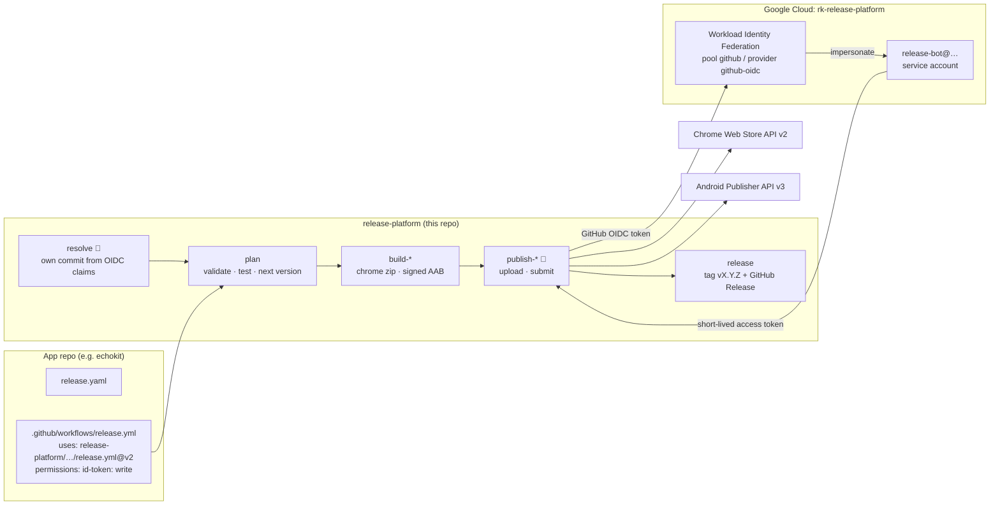

# release-platform

Keyless release pipelines for the **Chrome Web Store** and **Google Play**.

Any repo owned by `ravitejakamalapuram` can ship to either store (or both) with one small
`release.yaml` and a ten-line caller workflow. **No store credentials live in GitHub**: jobs
authenticate with GitHub OIDC → Google Cloud Workload Identity Federation → a service account
that is the Chrome Web Store publisher and a Play Console user. The only secrets are Android
upload keys, and they stay in each app repo.

- [How it works](#how-it-works) · [Security model](#security-model)
- [Onboarding a new app](#onboarding) · [Migrating from .github-workflows-shared](#migrating-from-github-workflows-shared)
- [PR checks](#pr-checks) · [Releasing](#releasing) · [Promoting (Play)](#promoting-google-play) · [Dashboard](#dashboard)
- [release.yaml reference](#releaseyaml-reference)
- [Troubleshooting](#troubleshooting)
- [One-time setup (already done)](#one-time-setup-already-done)
- [Developing this repo](#developing-this-repo)

## How it works



### Auth without secrets

1. The job asks GitHub for an OIDC token (this is what `permissions: id-token: write` allows).
   The token is signed by GitHub and names the repo, owner and — for reusable workflows — the
   workflow that is running (`job_workflow_ref`).
2. [`google-github-actions/auth`](https://github.com/google-github-actions/auth) exchanges it at
   the Workload Identity provider, which only accepts tokens where
   `repository_owner == "ravitejakamalapuram"` **and** `job_workflow_ref` starts with
   `ravitejakamalapuram/release-platform/.github/workflows/`.
3. The federated identity impersonates `release-bot@rk-release-platform.iam.gserviceaccount.com`
   and gets a one-hour access token scoped to `chromewebstore` or `androidpublisher`.

Because of rule 2, store calls **must** run inside this repo's reusable workflows; a step in an
app repo cannot mint store tokens even though it is owned by the same account. There is nothing
to leak, rotate or expire.

### Security model

Rule 2 also means **any code running in a job of these workflows that holds `id-token: write`
can mint store tokens** — the OIDC token names release-platform as the workflow, whoever's code
is executing. So the platform keeps one invariant:

> **No job that executes app-controlled code has `id-token: write`.**
> App-controlled code = anything from the caller repo: `test`, `build`, `npm ci`, Gradle, Flutter,
> postinstall scripts, Gradle plugins, and so on.

| Workflow · job | Runs app code? | `id-token` | Secrets |
| --- | --- | --- | --- |
| release · `resolve` (🔑 above) | no — no app checkout; only reads its own OIDC claims to find the release-platform commit | yes | none |
| release · `plan` | yes (test gate) | **no** | none |
| release · `build-chrome` | yes (build) | **no** | none |
| release · `build-android` | yes (Gradle/Flutter) | **no** | Android upload key only |
| release · `publish-*` (🔑) | no — release-platform scripts on downloaded zip/AAB artifacts only | yes | none |
| release · `release` | no | no (`contents: write`) | none |
| promote · `config` | no (reads `release.yaml` as data with `yq`) | no | none |
| promote · `play` | no — never checks out the caller repo | yes | none |
| status · `status` | no — reads `apps.yaml` from release-platform only | yes | none |
| app-ci · all jobs | yes | **no** | **none** |

Jobs run on fresh hosted VMs, so a build job cannot tamper with a later publish job except
through its artifacts, which publish jobs only upload to the store and never execute. Values from
`release.yaml` reach scripts through environment variables, never through `${{ }}` interpolation
into shell. When changing a workflow here, keep the table true.

### Pipeline guarantees

- **Fail fast.** `release.yaml` is validated against [`schema/release.schema.json`](schema/release.schema.json)
  before anything runs, with messages like `$.targets[0].item_id: must match … (the 32-letter Chrome Web Store item id)`.
- **Test gate.** The optional `test` command runs before anything is built or uploaded.
- **Build everything, then publish.** Every target is built and packaged first; stores are only
  touched once all builds succeeded.
- **Never burn a tag.** `vX.Y.Z` and the GitHub Release are created only after *every* target
  was accepted by its store. If a publish job fails, fix the cause and use **Re-run failed jobs**:
  the version is kept, so the retry uploads the same build.
- **Preflight checks.** Chrome: refuses early if an item is already in review or the store has an
  equal/higher version. Play: refuses if any track already has an equal/higher versionCode, and
  verifies the uploaded bundle carries the expected versionCode.

## Onboarding

Three steps per app.

**1. Add `release.yaml` at the repo root.** Start from an example:
[chrome only](examples/chrome-only.release.yaml) ·
[android only (Flutter)](examples/android-only.release.yaml) ·
[chrome + android](examples/chrome-and-android.release.yaml).

```yaml
# yaml-language-server: $schema=https://raw.githubusercontent.com/ravitejakamalapuram/release-platform/main/schema/release.schema.json
app: echokit
test: npm ci && npm test
targets:
  - type: chrome
    item_id: jndhbmaokpclbpjoogffaimahadpidcf
    path: extension
```

**2. Add the two caller workflows.**

- [`templates/ci-caller.yml`](templates/ci-caller.yml) → `.github/workflows/ci.yml` (PR checks):

  ```yaml
  on: { pull_request: {}, push: { branches: [main] } }
  jobs:
    ci:
      permissions: { contents: read, actions: read }
      uses: ravitejakamalapuram/release-platform/.github/workflows/app-ci.yml@v2
      # no secrets, no id-token
  ```

- [`templates/release-caller.yml`](templates/release-caller.yml) → `.github/workflows/release.yml`
  (manual `workflow_dispatch`):

  ```yaml
  jobs:
    release:
      permissions:
        contents: write   # tag + GitHub Release
        id-token: write   # keyless Google auth
      uses: ravitejakamalapuram/release-platform/.github/workflows/release.yml@v2
      secrets: inherit    # Android upload key only
  ```

For Android promotion also copy [`templates/promote-caller.yml`](templates/promote-caller.yml)
and create a `production` environment (Settings → Environments) with required reviewers.

**3. Android only: upload key + Gradle snippet.**

Add four repo secrets (Settings → Secrets and variables → Actions):

| Secret | Value |
| --- | --- |
| `ANDROID_KEYSTORE_BASE64` | `base64 -i upload-keystore.jks` |
| `ANDROID_KEYSTORE_PASSWORD` | keystore password |
| `ANDROID_KEY_ALIAS` | key alias |
| `ANDROID_KEY_PASSWORD` | key password |

Different names? Map them in the target's `signing:` block (TelePort uses `RELEASE_*`).

Signing needs **no Gradle changes**: the workflow writes the Android Gradle Plugin's own
`android.injected.signing.*` properties to `~/.gradle/gradle.properties`, which signs any release
build. If your build script has its own `signingConfig`, it can read `RELEASE_KEYSTORE_FILE`,
`RELEASE_KEYSTORE_PASSWORD`, `RELEASE_KEY_ALIAS`, `RELEASE_KEY_PASSWORD` (also exported as
`KEYSTORE_FILE`, `KEYSTORE_PASSWORD`, `KEY_ALIAS`, `KEY_PASSWORD`).

The version **does** need one snippet, so the build uses the version the pipeline computed
(`./gradlew bundleRelease -PversionCode=… -PversionName=…`):

```kotlin
// app/build.gradle.kts
android {
    defaultConfig {
        versionCode = (findProperty("versionCode") as String?)?.toInt() ?: 1
        versionName = (findProperty("versionName") as String?) ?: "0.0.0-dev"
    }
}
```

```groovy
// app/build.gradle
android {
    defaultConfig {
        versionCode((project.findProperty('versionCode') ?: '1') as int)
        versionName(project.findProperty('versionName') ?: '0.0.0-dev')
    }
}
```

Flutter apps use a custom `build:` command instead; `VERSION_NAME` and `VERSION_CODE` are exported
(`flutter build appbundle --build-name "$VERSION_NAME" --build-number "$VERSION_CODE"`).

Finally, add the app to [`apps.yaml`](apps.yaml) so it shows on the dashboard.

## Migrating from .github-workflows-shared

Per app repo:

1. **Add `release.yaml`** (above). Take `item_id` / `package` from the old workflow inputs or
   `chrome-extension-id` secret; set `path` to the directory the old packaging step zipped.
2. **Replace the workflows.** Delete every workflow that `uses: ravitejakamalapuram/.github-workflows-shared/...`
   (`chrome-extension-ci/cd/publish/status`, `android-ci/cd`, `flutter-ci/cd`, `detect-changes`,
   `validate-repo`, …) and add `ci.yml` + `release.yml` from the templates (plus `promote.yml` for
   Play apps).
3. **Android signing secrets.** Keep the keystore secrets you already have and map their names in
   `signing:` (e.g. TelePort's `RELEASE_*`), or rename them to the `ANDROID_*` defaults. Add the
   Gradle version snippet if the app doesn't read `-PversionCode` / `-PversionName` yet. Flutter
   apps: set `build:` and `ci_build:` (see the [example](examples/android-only.release.yaml)).
4. **Align versions with the stores.** The next version comes from the latest `vX.Y.Z` tag, and
   both stores reject versions that are not higher than what they already have. If a store is
   ahead of your tags (for example a Play track with a larger versionCode), tag the current
   store version on `main` first. The preflight checks fail with the exact number otherwise.
5. **Dry run.** Run the release workflow with `dry_run: true`; it validates, tests, builds,
   packages and authenticates without uploading.
6. **Delete the old credentials** once the first real release succeeds: `CHROME_CLIENT_ID`,
   `CHROME_CLIENT_SECRET`, `CHROME_REFRESH_TOKEN` (any `chrome-*` OAuth secrets), Play
   service-account JSON (`PLAY_SERVICE_ACCOUNT_KEY` / `PLAY_STORE_CREDENTIALS`) and any `PAT_TOKEN`
   that only served the old pipelines. Nothing replaces them: auth is keyless now.

What changes in behavior: releases are manual (`workflow_dispatch`) by default, tags are created
only after every store accepted the release, and PR checks build exactly what a release would.

## PR checks

`app-ci.yml` runs on pull requests and pushes to `main` with **no secrets and no `id-token`**:

1. validate `release.yaml` against the schema,
2. run the `test` command,
3. per target: *chrome* — run `build`, package the zip with the same allow/denylist and
   manifest-reference check as a release (the zip is kept as a 7-day artifact); *android* — run
   `./gradlew <ci_task>` (default `assembleDebug`, unsigned/debug) or your `ci_build` command.

## Releasing

Run the app repo's **release** workflow (Actions → release → Run workflow):

| Input | Meaning |
| --- | --- |
| `bump` | `auto` (default), `patch`, `minor`, `major` |
| `dry_run` | Validate, test, build, package and authenticate — but no upload, tag or release |
| `targets` | Only these target types, e.g. `chrome` (empty = all) |

**Versioning.** The next version comes from the highest strict `vX.Y.Z` tag. With `auto`, the
[conventional commits](https://www.conventionalcommits.org) since that tag decide: `feat` → minor,
`!` or `BREAKING CHANGE:` → major, anything else → patch (`auto` refuses to release when there
are no new commits). With no tag yet, the version in the first target's `manifest.json` /
`package.json` / `build.gradle(.kts)` / `pubspec.yaml` is the baseline. The Play `versionCode` is
`MAJOR*1_000_000 + MINOR*1_000 + PATCH` (MINOR and PATCH must stay ≤ 999).

**Per target.**

- *chrome*: optional `build`, then `manifest.json`'s `version` is stamped in a staging copy, the
  directory is zipped (allowlist via `include`, otherwise everything except `.git*`,
  `node_modules`, `*.md`, `*.map`, tests, `scripts/`, store assets, `.env*`, lockfiles …), and the
  zip is checked against every file the manifest references. Then `upload` → `publish` (submit
  for review; `publish: false` uploads a draft) → `fetchStatus` is printed.
- *android*: JDK + Android SDK (`platform-tools` only), optional Flutter, keystore decoded to
  `$RUNNER_TEMP` (deleted afterwards), `./gradlew <gradle_task>` or your `build`, then a Play edit:
  upload bundle → set `track` release (`completed`, or `draft` for draft apps) with en-US
  "What's new" from the first section of `release_notes` (≤ 500 chars; falls back to the
  generated commit notes) → commit. If Play answers that changes cannot be sent for review
  automatically, the commit is retried with `changesNotSentForReview=true` and the job warns
  that someone must press **Send for review** in Play Console.

The job summary shows one row per target (version and store result). The GitHub Release carries
the zip / AAB and the generated notes.

## Promoting (Google Play)

Run the app's **promote** workflow ([template](templates/promote-caller.yml)). It runs in the
`production` environment, so it waits for approval if the environment requires reviewers.

| `action` | Effect |
| --- | --- |
| `promote` | Newest completed release on `from_track` → `to_track`; staged when `user_fraction` < 1 |
| `rollout` | Raise the in-progress (or resume a halted) rollout on `to_track` to `user_fraction` (1 = complete) |
| `halt` | Halt the in-progress rollout on `to_track` |
| `complete` | Roll the in-progress/halted release on `to_track` out to 100% |

The package defaults to the first android target in `release.yaml`.

## Dashboard

[`dashboard.yml`](.github/workflows/dashboard.yml) runs daily (and on demand) and calls the
reusable [`status.yml`](.github/workflows/status.yml) for every app in [`apps.yaml`](apps.yaml).
It is read-only: Chrome uses `fetchStatus` with the `chromewebstore.readonly` scope; Play inserts
an edit, lists tracks and **deletes** the edit (never commits). The table goes to the run's job
summary and is force-pushed as the only file of the orphan **`status` branch**:
[STATUS.md](../../blob/status/STATUS.md). One broken item shows a warning in its row instead of
failing the run.

## release.yaml reference

Top level: `app` (slug, required), `test` (optional command), `targets` (≥ 1). Full schema:
[`schema/release.schema.json`](schema/release.schema.json).

**chrome**

| Key | Default | |
| --- | --- | --- |
| `item_id` | required | 32-letter store id |
| `path` | required | directory with `manifest.json` **after** the build |
| `build` | none | shell command run at the repo root (`VERSION_NAME` exported) |
| `node` | `'22'` | Node.js version for `build` |
| `include` | everything minus junk | allowlist of files, dirs or globs relative to `path` |
| `publish` | `true` | `false` = upload a draft, don't submit for review |

**android**

| Key | Default | |
| --- | --- | --- |
| `package` | required | application id |
| `gradle_task` | `bundleRelease` | release build task |
| `ci_task` | `assembleDebug` | PR-check Gradle task (no signing secrets available) |
| `ci_build` | none | PR-check command instead of `./gradlew <ci_task>` (e.g. `flutter build apk --debug`) |
| `build` | none | replaces `./gradlew <gradle_task>` (e.g. Flutter) |
| `flutter` | none | install this Flutter version first |
| `aab` | `app/build/outputs/bundle/release/app-release.aab` | bundle produced by the build |
| `java` | `'17'` | Temurin JDK |
| `track` | `internal` | upload track |
| `release_status` | `completed` | `draft` while the app itself is a draft in Play Console |
| `release_notes` | generated notes | Markdown changelog; first `## ` section → en-US "What's new" |
| `signing` | `ANDROID_*` names | secret names: `keystore_base64`, `keystore_password`, `key_alias`, `key_password` |

Reusable workflow inputs besides the above: `directory` (where `release.yaml` lives; tags stay
repo-wide) and `platform_ref` (advanced; which release-platform commit's scripts to use — by
default the exact commit of the workflow you called, read from the OIDC token's `job_workflow_sha`).

## Troubleshooting

| Symptom | Cause / fix |
| --- | --- |
| `must grant 'permissions: id-token: write'` | Add `id-token: write` to the calling job. |
| `google-github-actions/auth` fails with `unauthorized_client` / attribute condition | The store step ran outside this repo's workflows, or the repo is not owned by `ravitejakamalapuram`. Call the reusable workflow; don't copy its steps. |
| `Permission 'iam.serviceAccounts.getAccessToken' denied` | The `workloadIdentityUser` binding on `release-bot` is missing (see setup). |
| Chrome: `already has a submission in review` | CWS accepts no new package while one is pending. Wait, or cancel the submission in the Developer Dashboard, then re-run. |
| Chrome: `Version X is not higher than Y` | The store is ahead of your tags. Push a `vY` tag (or larger) on an older commit, or release with `bump: minor`. |
| Chrome: `Not authorized for item …` | The item is not under publisher `9637cb78-…`, or `release-bot` is not the publisher's service account. |
| Chrome: `can't publish using the API` after visibility changes | Publish once manually in the dashboard after changing visibility; the API always uses the existing visibility. |
| Chrome: `Package would be missing files referenced by manifest.json` | The denylist removed something your manifest needs (e.g. a `scripts/` dir). Set `include`. |
| Play: `Not authorized for <package>` | Invite `release-bot@rk-release-platform.iam.gserviceaccount.com` in Play Console → Users and permissions, with release rights for the app. |
| Play: `versionCode N is not higher than M` | Play already has a larger code (often from an older scheme). Tag at or above that version (`M = MAJOR*1e6+MINOR*1e3+PATCH`) or use a bigger bump. |
| Play: `The bundle has versionCode 1, expected …` | Add the Gradle version snippet above. |
| Play: `Only releases with status draft may be created on draft app` | Set `release_status: draft` until the first manual release. |
| Play warning: changes were not sent for review | The app needs manual review submission: Play Console → Publishing overview → Send for review. |
| `Android signing secrets missing` | Add the four secrets and make sure the caller passes `secrets: inherit`. |
| `Tag vX.Y.Z already exists` | A previous run already tagged. Pass a bigger bump or delete the stale tag. |
| `No commits since vX.Y.Z` | Nothing to release with `auto`; pick an explicit bump to force it. |

## One-time setup (already done)

Recorded for reference; nothing here needs to be repeated for new apps.

**Google Cloud project `rk-release-platform` (number `335964689163`)**, billing not required.

- APIs enabled: `iamcredentials`, `sts`, `iam`, `chromewebstore`, `androidpublisher`.
- Workload Identity pool `github`, OIDC provider `github-oidc`
  (issuer `https://token.actions.githubusercontent.com`):
  - attribute mapping: `google.subject=assertion.sub`, `attribute.repository=assertion.repository`,
    `attribute.repository_owner=assertion.repository_owner`, `attribute.job_workflow_ref=assertion.job_workflow_ref`
  - attribute condition:
    `assertion.repository_owner == "ravitejakamalapuram" && assertion.job_workflow_ref.startsWith("ravitejakamalapuram/release-platform/.github/workflows/")`
- Service account `release-bot@rk-release-platform.iam.gserviceaccount.com` with
  `roles/iam.workloadIdentityUser` for
  `principalSet://iam.googleapis.com/projects/335964689163/locations/global/workloadIdentityPools/github/attribute.repository_owner/ravitejakamalapuram`.
  It has no project roles and no keys.

```sh
gcloud iam workload-identity-pools providers describe github-oidc \
  --workload-identity-pool=github --location=global --project=rk-release-platform
gcloud iam service-accounts get-iam-policy release-bot@rk-release-platform.iam.gserviceaccount.com
```

**Chrome Web Store.** Publisher `9637cb78-fa33-49dd-a4cb-91066ff182e3`; in the Developer
Dashboard → Account, `release-bot@…` is set as the publisher's service account. All items must
live under this publisher.

**Google Play.** `release-bot@…` is invited under Users and permissions with release permissions
for each app.

There is intentionally **no Secret Manager** (billing is closed); Android upload keys are the only
secrets and live in each app repo.

## Developing this repo

```sh
npm test                       # node --test, no dependencies
actionlint                     # workflows + templates
yq -o=json . examples/chrome-only.release.yaml > /tmp/r.json && node scripts/validate.mjs --config /tmp/r.json
```

Layout:

```
.github/workflows/  release.yml promote.yml status.yml app-ci.yml (reusable) · dashboard.yml ci.yml (this repo)
scripts/            cws.mjs play.mjs version.mjs validate.mjs package-chrome.mjs changelog.mjs status.mjs summary.mjs
scripts/lib/        http.mjs (Google API client) gha.mjs (runner helpers) schema.mjs (tiny JSON Schema validator)
schema/             release.schema.json
templates/          caller workflows to copy into app repos
examples/           release.yaml examples
tests/              node:test suites + fixtures (CI runs app-ci.yml and a release dry run against tests/fixtures/chrome-app)
apps.yaml           dashboard registry
```

Scripts are plain Node 20+ ESM with zero dependencies (`fetch`, `node:test`); YAML is converted
with the runner's preinstalled `yq`. Every API call takes an injectable `fetch`, so the tests
cover request construction and error handling without network access.

**Releasing the platform itself.** Consumers pin the moving major tag `@v2`. After merging to
`main`: `git tag v2.X.Y && git tag -f v2 && git push origin v2.X.Y && git push -f origin v2`.
Breaking changes to inputs or `release.yaml` go to `v3`.
